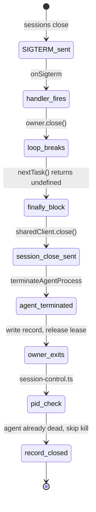

## Context

ACP defines [`session/close`][session-close] for cancelling ongoing work and
freeing server-side session resources. Agents advertise support via
`sessionCapabilities.close`. When supported, `acpx` must send this call before
terminating the agent process.

[session-close]: https://agentclientprotocol.com/rfds/session-close

## Session close behavior

`AcpClient.close({ sendSessionClose: true })` sends `session/close` for the
loaded session before terminating the agent process. The call is gated by
`sessionCapabilities.close`, bounded by `sessionCloseGraceMs` (default 1500 ms),
and best-effort. Plain `close()` without the option releases the client
connection and kills the agent without sending `session/close`.

Callers that end the session pass the option:

- `runOnce` (exec/oneshot)
- `runSessionPrompt` (prompt with own client)
- `runSessionQueueOwner` (queue owner via `sharedClient`)

Callers that detach without ending the session (e.g. `sessions new`,
`createSessionWithClient`) call plain `close()`.

`session-control.ts` does not send `session/close`. It terminates the process
that owns the client.

## Queue owner graceful shutdown

The queue owner runs detached. `sessions close` terminates it via SIGTERM.
Node.js default SIGTERM exits immediately without running finally blocks, so
`runSessionQueueOwner` registers a handler:

```js
const onSigterm = () => {
  void owner?.close();
};
process.on("SIGTERM", onSigterm);
```

This breaks the `nextTask()` loop so the finally block runs and
`sharedClient.close()` sends `session/close`. The handler is removed in the
finally block.

`process.on` is used instead of `once` because the perf-metrics handler
re-raises SIGTERM after removing itself. During an active prompt,
`withInterrupt` also fires and cancels the prompt. Both coexist without
conflict.

## Teardown sequence



`session-control.ts` also attempts to kill the agent PID directly as a
fallback when the queue owner was already dead.
